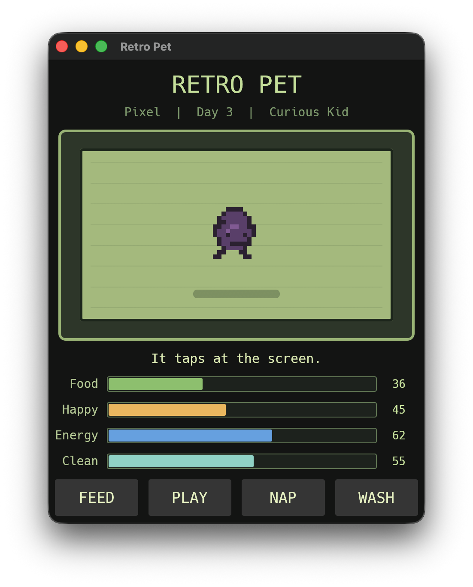

# Retro Pet

A tiny desktop companion inspired by classic virtual pets. Retro Pet is built in Rust with `eframe`/`egui`, draws its own pixel-style pet, and keeps your pet alive between app launches.

## Features

- Native desktop window with a retro handheld-style interface
- Randomly generated pets with names, personalities, palettes, body shapes, eyes, and antenna variants
- Persistent state saved locally as JSON
- Food, happiness, energy, and cleanliness meters that change over time
- Simple care actions: feed, play, nap, and wash
- Responsive layout: the pet screen and buttons scale with the window

## Screenshot



## Getting Started

Install Rust, then clone and run:

```bash
git clone git@github.com:forjd/retro-pet-rust.git
cd retro-pet-rust
cargo run
```

For a quick compile check:

```bash
cargo check
```

## Save Data

Retro Pet autosaves every few seconds and on normal app exit. On macOS, save data is stored at:

```text
~/Library/Application Support/com.Codex.RetroPet/pet.json
```

Deleting that file creates a fresh random pet the next time the app starts.

## Tech Stack

- Rust 2024 edition
- `eframe` / `egui` for native UI
- `serde` / `serde_json` for persistence
- `directories` for platform-aware save paths
- `rand` for pet generation

## License

MIT. See [LICENSE](./LICENSE).
